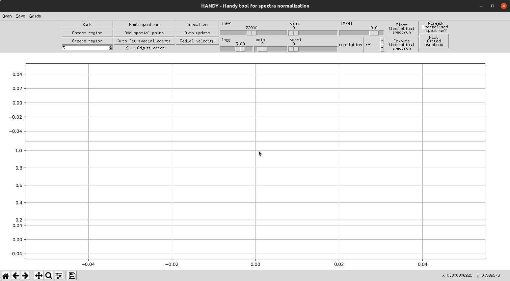
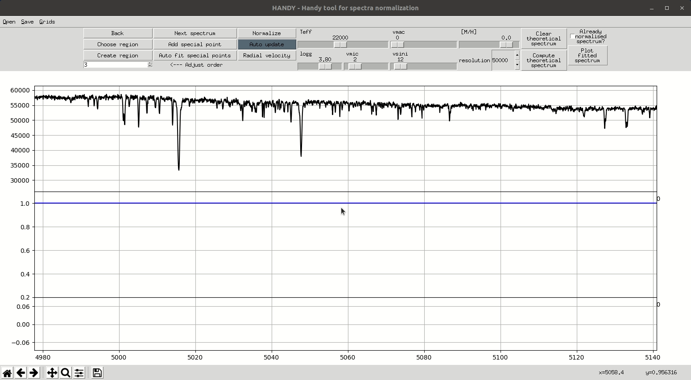
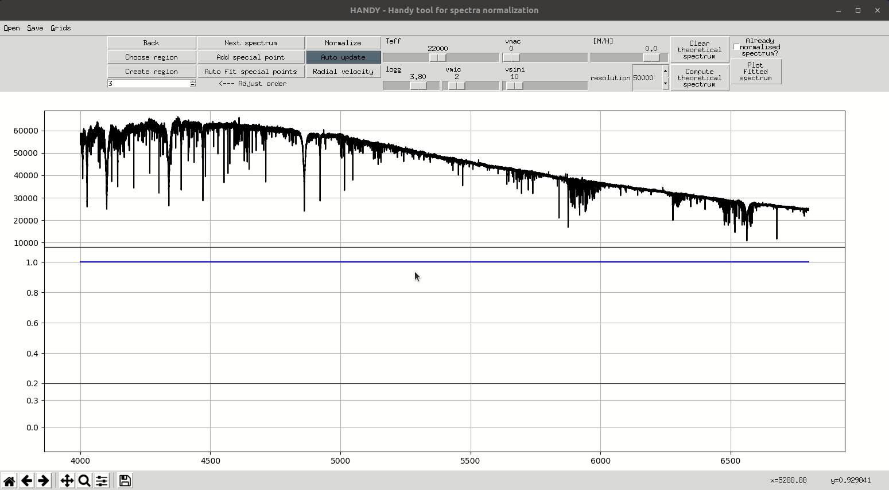

# HANDY - Handy tool for spectra normalization

HANDY is interactive Python3 program for spectrum normalization. The normalization process is based on "regions" and "ranges". "Ranges" are continuum parts defined manually by user (or uploaded from file from previous program run) which will be used for continuum level fit. "Regions" are groups of ranges for whom single chebyshev polynomial of chosen order is fitted. Polynomial fits are connected with the use of Akima'a spline interpolation. The program offers graphical access to theoretical grid of spectra for obtaining an idea about processed star atmosphere parameters and interface for radial velocity correction. Different grids of spectra can be easly added by the user. 

<p align="center">
  <a href="#key-features">Key Features</a> •
  <a href="#prerequisites">Prerequisites</a> •
  <a href="#download">Download</a> •
  <a href="#installing">Installing</a> •
  <a href="#tutorial">Tutorial</a> •
  <a href="#license">License</a> •
  <a href="#acknowledgments">Acknowledgments</a>
</p>



## Key Features

* Interactive normalization of spectrum in single run
* Portability of continuum ranges between different spectra
* Easy access to precomputed grid of NLTE stars spectra (computed with SYNSPEC, with use of BSTAR2006 models)
  - NLTE line blanketed model atmospheres of hot stars. I. Hybrid Complete Linearization/Accelerated Lambda Iteration Method, 1995, Hubeny, I., & Lanz, T., Astrophysical Journal, 439, 875
* Adding user defined grids
* Radial velocity correction 
* Developed and tested on Linux
* Easy installation and easy to use

## Getting Started

### Prerequisites

* Python3
* Conda - usefull but not necessary

### Download

Two steps:
* Clone the repository or download it as the .zip file:
  - Clone by:
    ```
    git clone https://github.com/RozanskiT/HANDY.git
    ```
  - Download zip from:
  https://github.com/RozanskiT/HANDY/archive/master.zip
* Download and untar folders with grids in your project catalog
  - Can be downloaded from : https://drive.google.com/open?id=1VH5hQ5toTWuPFA_6vIpD1aZxs6u0nmia
  
### Installing

You need Python3 with all needed packages.

The easiest way to work with HANDY is with [Conda enviroment manager](https://conda.io/docs/user-guide/tasks/manage-environments.html#creating-an-environment-from-an-environment-yml-file):

Run in HANDY catalog:
```
conda env create -f environment.yml
```
Activate the HANDY-env enviroment:
```
source activate HANDY-env
```
Verify if enviroment is installed correctly:
```
conda list
```
After that you may want to make symbolic link in your ~/bin/ directory to HANDY.sh file to be able to easly run the program in whole system. Eg. on my system:
```
ln -s ~/repos/HANDY/HANDY.sh ~/bin/HANDY
```
Then you should be able to simply run the program by executing:
```
HANDY
```
in your terminal.

### Update

If you used git to install HANDY you can easy update HANDY just by pulling changes from remote:
```
git pull
```
Otherwise you need to re-install HANDY from newly downloaded .zip file.

## Tutorial

Full description and tutorial could be find in HANDY project GitHub page:

https://rozanskit.github.io/HANDY/

But you can see some snapshots from main window below:

### Modyfying regions and ranges



### Adjusting order of fit


### Correcting for radial velocity


### Loading predefined continuum file



## License

This project is licensed under the MIT License - see the [LICENSE.txt](LICENSE.txt) file for details

## Acknowledgments

* [iSpec](http://adsabs.harvard.edu/abs/2014A%26A...569A.111B), by. S. Blanco-Cuaresma
* [PyAstronomy](https://github.com/sczesla/PyAstronomy)
* [SciPy](https://www.scipy.org/)
<!---
-->
