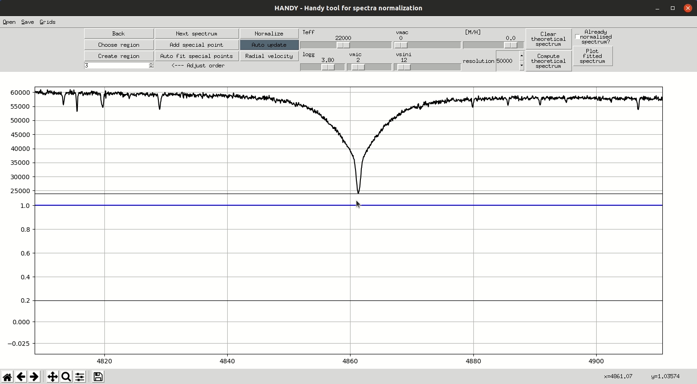

# HANDY - Use of regions and ranges

## Table of Contents
  * [Home](index.md)
  * [Install](install.md)
  * [Basics](basics.md)
  * [Regions and ranges](regions.md)
  * [Points](points.md)
  * [Radial velocity correction](radialVelocity.md)
  * [Grids](grids.md)

## Regions and ranges of continuum

Regions wich are composed of ranges are basic structure in HANDY program. User manually add range by range, to make it possible to fit continuum line. Because spectrum always has got some residual-postpipeline structure it is impossible to normalize spectrum simply by using single polynomial fit for whole. Because of that we introduce regions which are defined by the fact that for single region one polynomial is fitted. The type of polynomial is fixed to chebyshev, its degree can be easly adjusted. Each region is composed of ranges which are simply used for fitting given polynomial. Important property of regions is that they **cannot overlap**.

Regions need to be connected to make it possible to establish continuum for whole range of wavelenght. In order to do that each region fit is computed at some lineary-spaced points (with some default spacing). Then points which belong to all existing regions are connected by Akima-spline function. 

There are two important notes:
* group of that points can be extended by _special Points_ manually defined by user (see more: [Points](points.md))
* regions/ranges and Points could be defined only on the top plot of the main window

## Regions and ranges manipulations

* **Left mouse click** - you can add new range by keeping this button pressed while moving the mouse. If there was not any region the new one will be created. If there were some regions, the new range will be a part of the active region
* **Right mouse click** - when you click right mouse button the nearest range (or secial Point) will be removed
* **Mouse scroll click / button _Choose region_** - when you click on top plot the nearest region will became the active one
* **Button _Create region_** - when this button is active, next created range will belong to newly created region
* **Adjust order spinbox** - the value inside is the value of chevyshev polynomial fitted to currently active region

## Saving and loading regions/ranges (continuum files)

Regions and ranges can be easly save to be used for normalization of next precessed spectrum. It can be done with the menu option _Save->Save continuum_. So called _continuum files_ are ASCII files which keep information about all regions/ranges, its chebyshev polynomials fit order and also all special Points. 

Saved continuum file can be loaded by menu option _Open->Open continuum file_.

## Examples

### Example or regions and ranges manipulations

### Example of adjusting order

